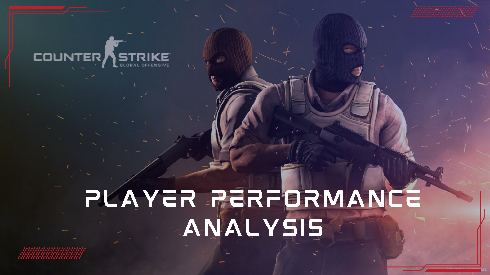

# CS:GO Player Performance Analysis – Data-Driven Insights into Esports  

 
 

## Project Overview  
This project analyzes **Counter-Strike: Global Offensive (CS:GO) professional player data** to explore **performance trends, player ranking changes, and competitive insights**.  

As my first **game data analytics** project, I have used **Python, Pandas, and Matplotlib** to extract meaningful insights.  

### **Key Questions Answered:**  
-  **Who are the top-performing players based on Kills Per Round (KPR)?**  
-  **How does Deaths Per Round (DPR) vary among players?**  
-  **What are the statistical distributions of key performance metrics?**  
-  **How do players' performances trend over time? (Future analysis)**  

---

##  Dataset Information  
- **Source:** Kaggle (CS:GO Pro Players Dataset)  
- **Size:** Approx. `0.193 MB`, contains statistics on professional CS:GO players  
- **Features Used:**
  - `Player`: Name of the player  
  - `KPR`: Kills Per Round (Main metric for player efficiency)  
  - `DPR`: Deaths Per Round (Risk factor metric)  
  - `Rounds Played`: Total rounds played  
  - `HLTV Rating`: Overall player ranking  
  - `Headshot %`: Accuracy and aiming efficiency  

 *More columns will be used in extended analysis (see future work section below).*

---

##  Data Analysis & Insights  

### ** Exploratory Data Analysis (EDA)**
- **Checked for missing values** & cleaned the dataset  
- **Basic statistics computed** for KPR, DPR, and other key metrics  
- **Visualized distributions** to understand player performance  

### ** Key Statistics**
- **Average Kills Per Round:** `0.69`  
- **Average Deaths Per Round:** `0.67`  
- **Player with the highest KPR:** `sh1ro`  

### ** Data Visualization**
  **Performance Distribution of Players**  
A histogram comparing KPR & DPR across all players.  

  

---

##  Tech Stack Used  
- **Python** 🐍  
- **Pandas** (Data Cleaning & Manipulation)  
- **Matplotlib** (Data Visualization)  
- **Seaborn** (Enhanced Graphs)  
- **Jupyter Notebook** (For EDA & Analysis)  

